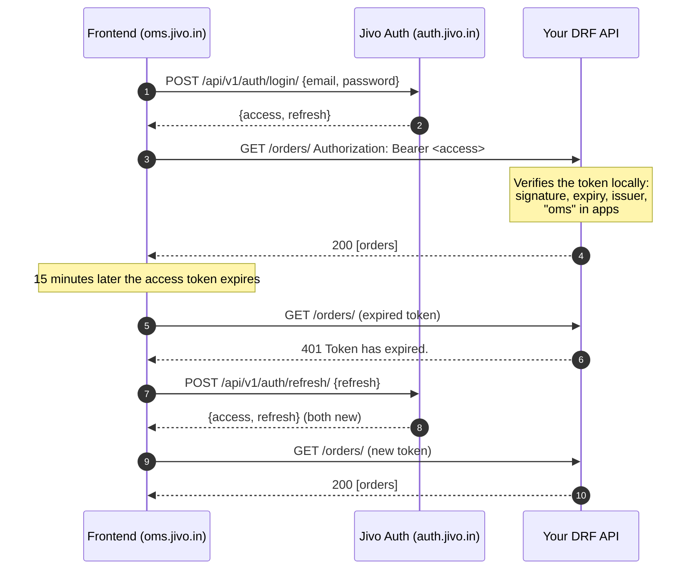

# Integrating a Django REST Framework API

This guide protects a **Django REST Framework** API with Jivo login.
Your frontend (React, Vue, a mobile app) logs users in at
**https://auth.jivo.in**, then calls your API with the access token. Your
API verifies each token itself, locally, using the `jivo-auth-client`
package (import name `jivo_auth`).

The examples use an application with the slug **`oms`**. Its frontend is
at `https://oms.jivo.in` and its API at `https://api.oms.jivo.in`.

> Building a server-rendered site with Django templates or the Django admin
> instead? See [session login](integrate-django.md#b-server-rendered-django-site-templates-admin).

**Contents**

1. [How it works](#how-it-works)
2. [Before you start](#before-you-start)
3. [Install](#install)
4. [Configure](#configure)
5. [Protect your views](#protect-your-views)
6. [Who is the user?](#who-is-the-user)
7. [Roles and permissions](#roles-and-permissions)
8. [Frontend: logging in and calling your API](#frontend-logging-in-and-calling-your-api)
9. [Looking up other users](#looking-up-other-users)
10. [Testing](#testing)
11. [Going live checklist](#going-live-checklist)
12. [Troubleshooting](#troubleshooting)
13. [Settings reference](#settings-reference)

---

## How it works



The key points:

- **Your API never sees passwords** and never calls Jivo Auth per request.
  The package only fetches Jivo Auth's public key, once, from
  `https://auth.jivo.in/.well-known/jwks.json`, and caches it. Your API
  keeps working through short Jivo Auth outages.
- **Access tokens last 15 minutes. Refresh tokens last 30 days** and
  change on every refresh.
- **Access is per application.** A user needs `oms` in their token's
  `apps` claim; everyone else gets 403 from your API.

## Before you start

| You need | Where from |
|---|---|
| Python 3.10+, Django 4.2+, DRF | Your project |
| Your application's **slug** (`oms`) | A Jivo Auth administrator ([registering an application](register-an-application.md)) |
| Your frontend's origin **allowed for CORS** at Jivo Auth | The same administrator |
| A test user **granted access** to `oms` | The same administrator |
| An **API key** | Only if your server looks up users ([below](#looking-up-other-users)) |

## Install

The package is in the private `Nareshkumar124/jivo-auth` repository. The
installing machine needs read access to it, through Git credentials, an
SSH key or a deploy key.

```bash
# uv
uv add "jivo-auth-client @ git+https://github.com/Nareshkumar124/jivo-auth.git#subdirectory=packages/jivo-auth-client" --rev <commit-sha>
```

```text
# requirements.txt
jivo-auth-client @ git+https://github.com/Nareshkumar124/jivo-auth.git@<commit-sha>#subdirectory=packages/jivo-auth-client
```

Pin a commit or tag rather than `main`. In Docker builds, pass a
read-only GitHub token as a build secret, or install a wheel built with
`uv build packages/jivo-auth-client`.

The package installs DRF and PyJWT (with `cryptography`) if you don't
have them.

## Configure

```python
# settings.py
INSTALLED_APPS = [
    # ...
    "rest_framework",
    "jivo_auth",            # enables the startup checks
]

REST_FRAMEWORK = {
    "DEFAULT_AUTHENTICATION_CLASSES": [
        "jivo_auth.authentication.JivoJWTAuthentication",
    ],
    "DEFAULT_PERMISSION_CLASSES": [
        "rest_framework.permissions.IsAuthenticated",
    ],
}

JIVO_AUTH = {
    "URL": "https://auth.jivo.in",
    "APP": "oms",
}
```

Keys can also come from environment variables, e.g. `JIVO_AUTH_URL` and
`JIVO_AUTH_APP`, when they're missing from the dict.

Run `python manage.py check`. It reports:

- a missing `APP`: without it **every user is refused**, so a forgotten
  setting can't let every Jivo account in
- misspelled keys
- no way to verify tokens

If your API really is for every Jivo user, set `"ALLOW_ALL_USERS": True`
instead of `APP`.

**If your frontend and API are on different origins** (`oms.jivo.in` →
`api.oms.jivo.in`), your API needs CORS too:

```python
# pip install django-cors-headers
INSTALLED_APPS += ["corsheaders"]
MIDDLEWARE.insert(0, "corsheaders.middleware.CorsMiddleware")
CORS_ALLOWED_ORIGINS = ["https://oms.jivo.in"]
# The Authorization header is allowed by default. Tokens aren't cookies,
# so leave CORS_ALLOW_CREDENTIALS off.
```

## Protect your views

With the settings above, **every view requires a valid Jivo token**. Opt
out explicitly where you need to:

```python
from rest_framework import permissions, viewsets
from rest_framework.decorators import api_view, permission_classes
from rest_framework.response import Response

class OrderViewSet(viewsets.ModelViewSet):      # protected by default
    serializer_class = OrderSerializer
    ...

@api_view(["GET"])
@permission_classes([permissions.AllowAny])    # public
def health(request):
    return Response({"status": "ok"})
```

A request is rejected before your view runs:

| Response | `detail` | What the client should do |
|---|---|---|
| **401** | `Authentication credentials were not provided.` | Log in. |
| **401** | `Token has expired.` | Refresh, then retry once. |
| **401** | `Invalid token.` | Refresh; if that fails, log in again. |
| **401** | `Access token required.` | Bug: it sent the refresh token. Send the access token. |
| **403** | `Your account does not have access to this application.` | Show "no access". Refreshing won't help until an admin grants access. |

`JivoJWTAuthentication` only handles `Authorization: Bearer ...`. Other
schemes are left to other authentication classes, so you can keep, say,
`SessionAuthentication` for the browsable API:

```python
"DEFAULT_AUTHENTICATION_CLASSES": [
    "jivo_auth.authentication.JivoJWTAuthentication",
    "rest_framework.authentication.SessionAuthentication",
],
```

**Swagger (drf-spectacular):** the package registers a `jivoAuth` bearer
security scheme automatically. Your Swagger UI's **Authorize** button then
takes a Jivo access token.

## Who is the user?

By default `request.user` is a lightweight **`JivoUser`** built from the
token, with no database involved:

```python
@api_view(["GET"])
def me(request):
    user = request.user          # jivo_auth.users.JivoUser
    return Response({
        "id": str(user.id),      # uuid.UUID, the same across every Jivo app
        "email": user.email,     # verified, lowercase
        "apps": user.apps,       # ("oms", ...)
    })
```

| Attribute | Value |
|---|---|
| `id`, `pk` | The Jivo user ID (`uuid.UUID`) |
| `email` | The user's email |
| `apps` | Tuple of application slugs; `has_app("oms")` checks one |
| `claims` | The full verified token payload |
| `is_authenticated` | `True` |
| `is_staff`, `is_superuser` | Always `False` |
| `has_perm(...)` | Always `False` |

`request.auth` is the raw access token string, if you need to forward it.
DRF's `UserRateThrottle` works as usual, keyed on the user's ID.

### Pick a user mode

| | Stateless (default) | Local users |
|---|---|---|
| `request.user` | `JivoUser` | A row of your `AUTH_USER_MODEL`, created on first request |
| Store "who did this" | `models.UUIDField()` holding the Jivo ID | A normal `ForeignKey` |
| Per-user permissions, groups, `is_staff` | Your own tables keyed by Jivo ID | Django's built-ins |
| Database hit per request | None | One lookup |
| Turn on with | Nothing | `"LOCAL_USERS": True` |

**Stateless: record the Jivo ID.**

```python
class Order(models.Model):
    created_by = models.UUIDField(db_index=True)     # Jivo user ID
    ...

class OrderViewSet(viewsets.ModelViewSet):
    def perform_create(self, serializer):
        serializer.save(created_by=self.request.user.id)

    def get_queryset(self):
        return Order.objects.filter(created_by=self.request.user.id)
```

**Local users: real foreign keys.**

```python
JIVO_AUTH = {
    "URL": "https://auth.jivo.in",
    "APP": "oms",
    "LOCAL_USERS": True,
    "LOCAL_USER_ID_FIELD": "username",   # where the Jivo ID is stored
}
```

```python
class Order(models.Model):
    created_by = models.ForeignKey(settings.AUTH_USER_MODEL, on_delete=models.PROTECT)

class OrderSerializer(serializers.ModelSerializer):
    created_by = serializers.HiddenField(default=serializers.CurrentUserDefault())
    ...
```

How local users behave:

- **Creation:** a row is created the first time a user calls your API,
  with `username` set to the Jivo ID, `email` from the token, and an
  unusable password. The email follows later tokens.
- **The token's claims** are available as `request.user.jivo_claims`.
- **Blocking locally:** setting `is_active=False` blocks that user in your
  API only, with a 401 `User account is disabled.`.
- **Custom user model:** point `LOCAL_USER_ID_FIELD` at any unique field,
  e.g. `jivo_id = models.UUIDField(unique=True)`, or at `"id"` if your
  primary key is a UUID that should equal the Jivo ID.

## Roles and permissions

Jivo Auth decides **who the user is** and **whether they may use `oms`**.
Everything finer, such as managers vs. clerks or record ownership, belongs
to your application.

**Object ownership:**

```python
class IsCreator(permissions.BasePermission):
    def has_object_permission(self, request, view, obj):
        return obj.created_by == request.user.id    # stateless
        # return obj.created_by == request.user     # local users
```

**Roles, stateless:** keep a small table keyed by Jivo ID:

```python
class Role(models.Model):
    jivo_user_id = models.UUIDField()
    name = models.CharField(max_length=30)       # "manager", "clerk", ...

class IsManager(permissions.BasePermission):
    message = "Only managers can do this."

    def has_permission(self, request, view):
        return Role.objects.filter(
            jivo_user_id=request.user.id, name="manager"
        ).exists()
```

**Roles, local users:** use Django groups and permissions:
`request.user.has_perm("orders.approve_order")`, or DRF's
`DjangoModelPermissions` and `IsAdminUser`.

## Frontend: logging in and calling your API

Jivo Auth's endpoints, relative to `https://auth.jivo.in/api/v1`:

| Call | Body | Returns |
|---|---|---|
| `POST /auth/login/` | `{email, password, device_name?}` | `{access, refresh}` |
| `POST /auth/refresh/` | `{refresh}` | `{access, refresh}`. **Store both**: the refresh token changes. |
| `POST /auth/logout/` | `{refresh}` | Ends this device's session. Works with an expired access token. |
| `GET /users/me/` | access token in `Authorization` | Profile: id, email, names, `apps` |
| `POST /users/resend-verification/` | `{email}` | Sends a new verification email |

Forgotten passwords: link to `https://auth.jivo.in/forgot-password/`. Jivo
Auth hosts the whole reset flow. Full reference:
[Swagger](https://auth.jivo.in/api/docs/).

A minimal client, refreshing once and on demand, however many requests fail
at the same time:

```js
const AUTH = "https://auth.jivo.in/api/v1";
const API = "https://api.oms.jivo.in";
const STORAGE_KEY = "jivoTokens";

// Always read the stored copy: another tab may have refreshed meanwhile.
const loadTokens = () => JSON.parse(localStorage.getItem(STORAGE_KEY) || "null");

function saveTokens(tokens) {
  if (tokens) localStorage.setItem(STORAGE_KEY, JSON.stringify(tokens));
  else localStorage.removeItem(STORAGE_KEY);
}

function postJSON(url, body) {
  return fetch(url, {
    method: "POST",
    headers: { "Content-Type": "application/json" },
    body: JSON.stringify(body),
  });
}

export async function login(email, password) {
  const response = await postJSON(`${AUTH}/auth/login/`, {
    email, password, device_name: "OMS web",
  });
  const data = await response.json();

  if (response.ok) return saveTokens(data);
  if (data.code === "email_not_verified") throw new Error("verify-email");
  if (response.status === 429) throw new Error("too-many-attempts");
  throw new Error("wrong-credentials");
}

let refreshing = null;

function refresh(rejectedAccess) {
  const tokens = loadTokens();

  if (!tokens) return Promise.reject(new Error("logged-out"));

  // Someone else already refreshed: just retry with the newer token.
  if (tokens.access !== rejectedAccess) return Promise.resolve();

  // One refresh at a time; concurrent callers wait for the same one.
  refreshing ??= postJSON(`${AUTH}/auth/refresh/`, { refresh: tokens.refresh })
    .then(async (response) => {
      if (!response.ok) {
        saveTokens(null);            // session ended: log in again
        throw new Error("logged-out");
      }
      saveTokens(await response.json());
    })
    .finally(() => { refreshing = null; });

  return refreshing;
}

export async function api(path, options = {}) {
  const send = (access) => fetch(API + path, {
    ...options,
    headers: { ...options.headers, Authorization: `Bearer ${access}` },
  });

  const tokens = loadTokens();
  if (!tokens) throw new Error("logged-out");

  let response = await send(tokens.access);

  if (response.status === 401) {
    await refresh(tokens.access);    // throws "logged-out" if it can't
    response = await send(loadTokens().access);
  }

  if (response.status === 403) {
    // Either your own permission classes, or no access to "oms" at all:
    // check the `detail` before showing "no access".
  }

  return response;
}

export async function logout() {
  const tokens = loadTokens();
  if (tokens) await postJSON(`${AUTH}/auth/logout/`, { refresh: tokens.refresh });
  saveTokens(null);
}
```

Things to get right:

- **Save both tokens after every refresh.** A just-used refresh token keeps
  working for 30 more seconds, which covers requests that were already in
  flight. After that, sending it again is treated as theft and **ends the
  session**.
- **Where to keep tokens.** `localStorage` keeps the user logged in across
  reloads, but any script injected into your page can read it. Keep a
  strict Content-Security-Policy. On mobile, use the Keychain (iOS) or
  Keystore (Android).
- **Showing "no access" early.** Decode the access token's payload
  (base64url of the middle part) and check `apps` includes `"oms"` right
  after login.
- **When changes arrive.** If an admin removes a user's access, or the user
  changes their password elsewhere, your API keeps accepting their current
  access token for up to 15 minutes. The next refresh then fails, or
  returns a token without `oms`.

## Looking up other users

To show who created an order, or fill an "assign to" picker, your server
can ask Jivo Auth about the users who have access to `oms`. This needs your
**API key**. It's a server-side secret; never send it to the frontend.

```python
JIVO_AUTH = {
    # ...
    "API_KEY": os.environ["JIVO_AUTH_API_KEY"],
}
```

```python
from jivo_auth.client import AuthClient
from jivo_auth.exceptions import AuthServiceError

client = AuthClient()

try:
    everyone = client.get_users()                # all users with access to oms
    people = client.get_users(order_creator_ids) # only these Jivo IDs; batched 100 per call
except AuthServiceError as exc:                  # .status, .data; AuthServiceUnavailable if unreachable
    ...

# [{"id": "3fa8...", "email": "alice@jivo.in", "first_name": "Alice",
#   "last_name": "Smith", "is_active": True}, ...]
```

Users without access to `oms` are never returned. Cache the results if you
call this often.

**Calling another Jivo API on the user's behalf:** forward their token,
`headers={"Authorization": f"Bearer {request.auth}"}`. The other API
accepts it if the user has access to that application too.

## Testing

Don't call auth.jivo.in from tests. Pick the level you need.

**Most view tests: skip authentication.**

```python
import uuid
from rest_framework.test import APITestCase
from jivo_auth.users import JivoUser

class OrderTests(APITestCase):
    def setUp(self):
        self.user = JivoUser(id=uuid.uuid4(), email="tester@jivo.in", apps=("oms",))
        self.client.force_authenticate(self.user)

    def test_list(self):
        response = self.client.get("/orders/")
        self.assertEqual(response.status_code, 200)
```

With `LOCAL_USERS`, create a `User` row and pass it to
`force_authenticate`.

**Tests that exercise the real token check.** Sign your own tokens with a
test key:

```python
# tests/jivo.py
import time
import uuid

import jwt
from cryptography.hazmat.primitives import serialization
from cryptography.hazmat.primitives.asymmetric import rsa
from django.test import override_settings

_TEST_KEY = rsa.generate_private_key(public_exponent=65537, key_size=2048)

TEST_PUBLIC_KEY = _TEST_KEY.public_key().public_bytes(
    serialization.Encoding.PEM,
    serialization.PublicFormat.SubjectPublicKeyInfo,
).decode()


def make_access_token(user_id=None, email="tester@jivo.in", apps=("oms",), **claims):
    now = int(time.time())
    payload = {
        "token_type": "access",
        "sub": str(user_id or uuid.uuid4()),
        "email": email,
        "apps": list(apps),
        "iss": "https://auth.jivo.in",
        "iat": now,
        "exp": now + 900,
        "jti": uuid.uuid4().hex,
        **claims,
    }
    return jwt.encode(payload, _TEST_KEY, algorithm="RS256")


# Verify with the test key instead of fetching Jivo Auth's.
use_test_keys = override_settings(
    JIVO_AUTH={
        "URL": "https://auth.jivo.in",
        "APP": "oms",
        "PUBLIC_KEY": TEST_PUBLIC_KEY,
    },
)
```

```python
from rest_framework.test import APITestCase
from .jivo import make_access_token, use_test_keys

@use_test_keys
class AuthTests(APITestCase):
    def test_other_application_is_refused(self):
        token = make_access_token(apps=("ecom",))
        self.client.credentials(HTTP_AUTHORIZATION=f"Bearer {token}")

        self.assertEqual(self.client.get("/orders/").status_code, 403)

    def test_expired_token_is_refused(self):
        token = make_access_token(exp=0)
        self.client.credentials(HTTP_AUTHORIZATION=f"Bearer {token}")

        self.assertEqual(self.client.get("/orders/").status_code, 401)
```

## Going live checklist

- [ ] `JIVO_AUTH["URL"]` is exactly `https://auth.jivo.in`: https, no
      trailing path.
- [ ] `JIVO_AUTH["APP"]` is your slug, and `python manage.py check` is
      clean.
- [ ] Your server can make outbound HTTPS requests to `auth.jivo.in`, to
      fetch the public key on the first request and after a key change.
- [ ] Your server's clock is synced (NTP). Up to 10 seconds of drift is
      tolerated.
- [ ] Jivo Auth allows your frontend's origin (CORS), and your API allows
      it too if it's on a different origin.
- [ ] The frontend stores **both** tokens after every refresh, and handles
      401 (refresh, then log in) and 403 (no access).
- [ ] Real users are granted `oms` in the Jivo Auth admin.
- [ ] `API_KEY`, if used, is in your secret store and never in frontend
      code or Git.

## Troubleshooting

| Symptom | Likely cause |
|---|---|
| `jivo_auth.E003` on `check` | `APP` isn't set. Every request would be refused. |
| `jivo_auth.E001` | A misspelled key in `JIVO_AUTH`. |
| Every request: 401 `Invalid token.` | Your `URL` doesn't match the token's `iss` (`http` vs `https`, a trailing path). Or the public key can't be fetched: look for `Could not fetch Jivo Auth signing keys` in your logs. |
| 401 `Token has expired.` straight after login | Server clock off by more than 10 seconds. |
| 403 for someone who should have access | Not granted in the Jivo Auth admin yet, or granted after their token was issued. They get it within 15 minutes, or at once by logging in again. |
| Browser: `blocked by CORS policy` on `auth.jivo.in` | Ask the Jivo Auth admin to add your frontend's origin. |
| Browser: `blocked by CORS policy` on your API | Configure `django-cors-headers` in your API. |
| Users are logged out unexpectedly | The frontend isn't saving the new refresh token after each refresh, or two tabs refresh with the same token more than 30 seconds apart. Share tokens between tabs through `localStorage`, as in the example. |
| `IsAdminUser` always denies | `JivoUser.is_staff` is always `False`. Use local users, or your own permission class. |

## Settings reference

The `JIVO_AUTH` keys relevant to a DRF API. Each can also be set as a
`JIVO_AUTH_<KEY>` environment variable.

| Key | Default | Meaning |
|---|---|---|
| `URL` | — | `https://auth.jivo.in`. Sets the expected issuer and where the public key is fetched from. |
| `APP` | — | Your slug. Tokens without it in `apps` get 403. |
| `ALLOW_ALL_USERS` | `False` | With no `APP`, accept every Jivo user instead of refusing everyone. |
| `LOCAL_USERS` | `False` | `request.user` is a row of your user model instead of a `JivoUser`. |
| `LOCAL_USER_ID_FIELD` | `"username"` | Field of your user model holding the Jivo ID. |
| `API_KEY` | — | For `AuthClient().get_users()`. |
| `LEEWAY` | `10` | Seconds of clock drift tolerated. |
| `TIMEOUT` | `5` | Seconds to wait when fetching keys or calling Jivo Auth. |
| `PUBLIC_KEY` | — | PEM public key to verify with instead of fetching one. Tests, or fully offline servers; must then be updated by hand if Jivo Auth's key changes. |
| `ISSUER` | `URL` | Expected `iss`. `""` disables the check (not recommended). |
| `JWKS_URL` | `URL` + `/.well-known/jwks.json` | Override where keys are fetched from. |
| `ALGORITHM` / `SECRET` | `RS256` / — | Only if Jivo Auth is switched to a shared HS256 secret. |
